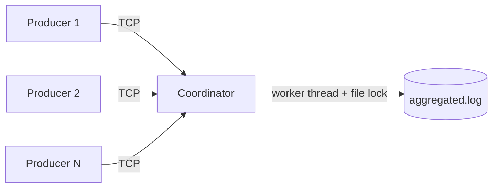

# Log Aggregator (OS2)

A POSIX client/server log aggregation system written in C.

Multiple **producers** (TCP clients) send `ID DATA` messages over `AF_INET` sockets to a
**coordinator** (TCP server), which aggregates them into a shared log file. The coordinator
uses one thread per connection, protects the log file with an exclusive write lock, and
rotates the log when it exceeds a configurable size.

## Features / Requirements

| Requirement | Implementation |
| --- | --- |
| TCP communication (`AF_INET`) | `socket()`/`bind()`/`listen()` in `coordinator.c`, `socket()`/`connect()` in `producer.c` |
| Message format `[TIMESTAMP, ID, DATA]` | `format_log_safe()` in `common.c` |
| Multiple concurrent connections | One detached worker thread per client (`pthread_create`) |
| Exclusive write access | `fcntl(F_FSETLKW)` write lock around each append (`lock_log()`/`unlock_log()`) |
| Append-mode logging | `open(..., O_WRONLY | O_CREAT | O_APPEND, 0644)` |
| Periodic size check / rotation | `SIGALRM` handler renames the log to a `.bak` archive and creates a fresh file |
| `SIGPIPE` handling | Handler logs `[TIMESTAMP, ID, "DISCONNECT"]` |
| `SIGINT` graceful shutdown | Closes the listening socket, waits for all workers to finish writing, then closes the log |
| Fast IP:PORT reuse | `SO_REUSEADDR` / `SO_REUSEPORT` |

## Architecture



## Project Structure

```
.
├── Makefile
├── README.md
├── include/
│   └── common.h          # Shared constants, prototypes, safe wrappers
├── src/
│   ├── common.c          # Safe I/O, file locking, timestamp/format helpers
│   ├── coordinator.c     # TCP server, threads, signal handlers
│   └── producer.c        # TCP client
└── tests/
    └── test_suite.c      # End-to-end verification of all requirements
```

## Build

Requires **Linux/POSIX** (the code uses `fork`, `pthread`, `fcntl`, and signal handling).
On Windows, use WSL:

```bash
wsl -d Ubuntu-22.04
cd /mnt/c/Users/<you>/Desktop/logAggregator-OS2
make            # builds bin/coordinator, bin/producer, bin/test_suite
```

## Usage

### Coordinator (server)

```bash
./bin/coordinator [-p port] [-l logfile] [-m max_size_bytes] [-t alarm_interval_sec]
```

| Flag | Default | Meaning |
| --- | --- | --- |
| `-p` | `8080` | Listening port |
| `-l` | `aggregated.log` | Log file name |
| `-m` | `1024` | Max size before rotation |
| `-t` | `2` | Rotation check interval (seconds) |

Stop it with `Ctrl+C` (`SIGINT`) for a graceful shutdown.

### Producer (client)

```bash
./bin/producer [-h host] [-p port] [-i id] [-d data] [-n count] [-s delay_ms] [-c]
```

| Flag | Default | Meaning |
| --- | --- | --- |
| `-h` | `127.0.0.1` | Coordinator host |
| `-p` | `8080` | Coordinator port |
| `-i` | `PRODUCER_01` | Sender ID |
| `-d` | `42.50` | Data value |
| `-n` | `1` | Number of messages |
| `-s` | `100` | Delay between messages (ms) |
| `-c` | off | Abort the connection abruptly (simulates a crash / RST) |

## Testing

```bash
make test
```

The test suite spawns a coordinator, drives it with producers, and **asserts** each
requirement instead of just printing output:

1. **Aggregation & format** — log contains every sender's ID, data value, and `[...]` lines.
2. **Fast port reuse** — a second coordinator binds the same port immediately.
3. **Log rotation** — a `.bak` archive is created, old data is archived, new data goes to the fresh log.
4. **Disconnect** — a `DISCONNECT` entry is recorded.
5. **Concurrency + rotation stress** — 4 parallel producers while the log is rotated repeatedly.

The suite prints `PASS`/`FAIL` per check and exits non-zero if any check fails.


